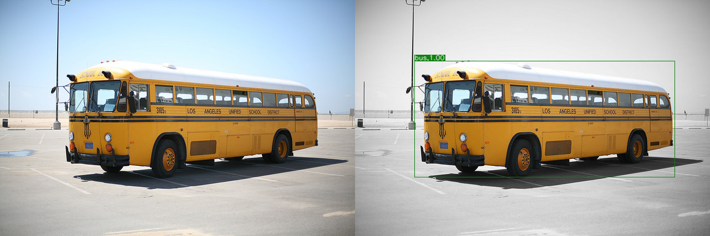
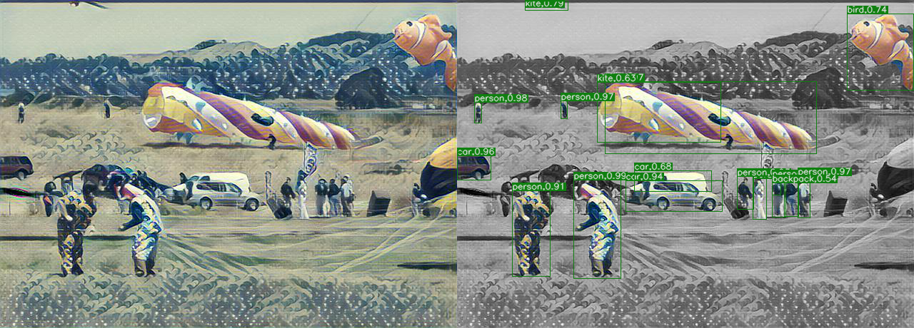
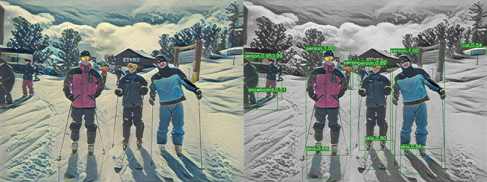
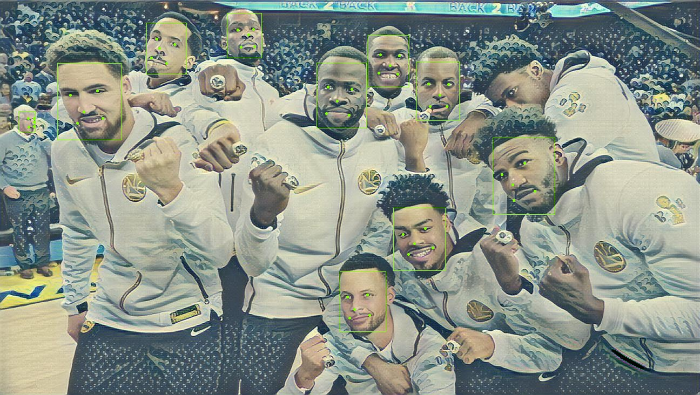

## Changes on this Branch
1. Add Batch-Instance Normalization capability. Batch-Instance Normalization on stylized images can improve object detection task on these images, for better detection of the pre-transformed objects. This is accomplished by adding and performing more batch norm versus instance norm at certain layers through learnable weights. The model can still use the default Instance Normalization only with --IN flag during training and inference.
2. The feed forward netowrk uses nearest neighbor to up size the image, then do a same size conv2d op. Instead of doing a conv2d_transpose op.
3. Remove the unnesssary total variation denoising regularization loss, due to #2 improvement.
4. Improve usability of command line arguments for style.py and evaluate.py.
5. Clean up and add comments throughout the codes. The comments are useful for someone who wants to study and understand this code.

This project investigated the effect of Batch-Instance Normalization for object recongition task and face detection/alignment task. 

It runs on Tensorflow 2. Other requirements to run this package incldue OpenCV, Pillow, scipy, and numpy. Please refer to the master branch for more software requirement information.

## Script for running multiple models (run_style.py)
Usage: python run_style.py [input_image]

Use run_style.py for evaluating single or multiple trained stylized feed-forward networks (checkpoints). Update the list of model names at line 19 of run_style.py to your model names.

Output images will be named in a form of input images plus the checkpoint name, and will be saved at the "./result" directory.

If your model was trained with Instance Normalzation, name your checkpoint directory with "_IN" in the checkpoint folder name, the script uses this property to add a --IN flag for doing loading the Instance Normalization model to fit your checkpoint.

## Results
All models that generated the following images were trained with 2 epochs and a batch size of 4.

Below, images are compared with their normalization counterparts. To be specific, an original content image is compared with one that does Instance Norm, one that does Batch-Instance Norm, and one that does Batch-Instance Norm without total variational denoising.

### Note on Total Variational Denoising
Images trained without TV denoising looks blurry and may improve its clarity with more training epochs, to be as good as the models with denoising. Futhermore, I notice content image with too few pixels do not get a good result, such as the ones in COCO training dataset.

### Note on Image Stylization
<p align = 'center'>

</p>
<p align = 'center'>
The Style Image for all models. The Great Wave off Kanagawa by Katsushika Hokusai.
</p>

Images with Batch-Instance norm performed indistinguishably to instance norm in style. Additionaly, I observed Batch-Instance norm produce smoother image on reconginzable objects, i.e. objects that we can define with a noun easily or have defined edging structures such as faces. In theory it should produce a more capable object recongnization task if the stylized image is fed as an input. And without total variational denoising, the pictures look grainier, but I suspect it is due to my under-trained feed forward network.

### Comparing Stylized Images
The one image in its own row is the content image, follow by the next row with three stylized images from left to right are produced with models that incoorperate either Instance Norm, Batch-Instance Norm, or Batch-Instance Norm no total variational denoising.

<p align='center'>

</p>
<div align='center'>


</div>

<p align='center'>

</p>
<div align='center'>


</div>

<p align='center'>

</p>
<div align='center'>


</div>

## Stylized Image on Object Detection Models
### Faster RCNN Model
This Faster RCNN model I use here is taken from [tensorpack](https://github.com/tensorpack/tensorpack/tree/master/examples/FasterRCNN)(R101-FPN). It was trained on COCO train2017 image dataset, and fine-turned from ImageNet pre-trained R101 model, more details can be read in the above link. It uses ResNet-101 and FPN(Feature Pyramid Network) as its backbone.

The purpose of running this model on stylized images is to analyze how much of an improvement Batch-Instance Norm, can help detect objects in a stylized image. The number belongs with each detection bounding box is the confidence score on its detection. As we can see from the images below, Batch-Instance normalized images produce vastly higher confidence scores, and more accurate classification than Instance normalized ones. Instance normalized ones are almost unrecongizable by Faster RCNN. However, Batch-Instance normalization is still far from to origial content image performance. I think it can be improved upon with more epoch training and parameter fine-tuning on the stylized feed forward net with Batch-Instance Norm. The below results were produced with no fine turning, and just kept the parameters the same between instance Norm model and batch-instance norm model.

Images compared here are the orignal content image, stylized image from Instance Norm model, and stylized image from Batch-Instance Norm model without TV denoising.

<br>
<div align='center'>



</div>
<br>

#### Content Image

#### With Instance Norm

#### With Batch-Instance Norm no total variational denoising


#### Content Image

#### After Instance Norm

#### After Batch-Instance Norm no total variational denoising


### MTCNN Model
This MTCNN model is obtained from Python Package Index (PyPI) (https://pypi.org/project/mtcnn/). The model is adapted from the Facenet’s MTCNN implementation. It detects human faces and labels five features of each detected face (two for eyes, one for nose, two for month).

The purpose of this experiment is to find out how well finer resolution image objects can be detected. And human face particularly is usually the most interesting subject of a photo, and each face is usually comparably small, occupying less pixels than many well-define objects, such as a car, a cat, or a dog. So I figure it will be interesting to do this finer, more focused detection task compared to the FasterRCNN. The reason I say more focus is because of MTCNN's three cascaded network detection on one usually small patch of an image.

MTCNN on stylized images see a significant degradation compared to original images. And between different stylized normalizations, there is no observable difference or improvement. I suspect it may due to MTCNN detection sensitivity that eliminates many true postives, and favors only the higher confidence information.

#### Content Image

#### With Instance Norm

#### With Batch-Instance Norm no total variational denoising


#### Content Image

#### With Instance Norm

#### With Batch-Instance Norm no total variational denoising


#### Content Image

#### With Instance Norm

#### With Batch-Instance Norm no total variational denoising


## Thoughts on generating a single feed forward network for many styles
Since this work is a single feed forward network for a style, I thought I will share my opinions on a netowrk for multiple styles, particularly from reading the paper "A Learned Representation For Artistic Style" by Google.

In our feed forward network, the conv_tranpose_layer, by doing nearest neighbor upsize and proceed with convolution SAME size padding. The padding for convolution is default to zero padding, but we could try the mirror padding mentioned in the paper to see if it generates a better image.

Also we can try merging batch-instance normalization and conditional instance normalization proposed by the paper. The conditional instance normalization is the key element to control various styles in one feed forward network.

About training for many styles, the paper described “Since all weights in the transformer network are shared between styles, one way to incorporate a new style to a trained network is to keep the trained weights fixed and learn a new set of γ and β parameters.” Basically it says all styles can be explained by the same weights in the feed forward network, generating different style is simply an affine transformation on existing weights.

The discussion of this paper is very important, it opens many thoughts for future works.

## References
### Style Transfer
Leon A Gatys, Alexander S Ecker, and Matthias Bethge. Image style transfer using convolutional neural networks. In CVPR, 2016.

Justin Johnson, Alexandre Alahi, and Li Fei-Fei. Perceptual losses for real-time style transfer and super-resolution. In ECCV, 2016.

Better Upsampling, https://distill.pub/2016/deconv-checkerboard/

Dumoulin, V., Shlens, J., & Kudlur, M. (2017). A Learned Representation For Artistic Style. ArXiv, abs/1610.07629.

### Normalization
Sergey Ioffe and Christian Szegedy. Batch normalization: Accelerating deep network training by reducing internal covariate shift. In ICML, 2015.

Jimmy Lei Ba, Jamie Ryan Kiros, and Geoffrey E Hinton. Layer normalization. arXiv preprint arXiv:1607.06450, 2016.

DmitryUlyanov,AndreaVedaldi,andVictorS.Lempitsky.Instance normalization:Themissingingredient for fast stylization. arXiv preprint arXiv:1607.08022, 2016.

Yuxin Wu and Kaiming He. Group normalization. arXiv preprint arXiv:1803.08494, 2018.

### Faster RCNN
Ren, S., He, K., Girshick, R., & Sun, J. (2016). Faster r-cnn: Towards real-time object detection with region proposal networks. IEEE transactions on pattern analysis and machine intelligence, 39(6), 1137-1149.

Kaiming He, Xiangyu Zhang, Shaoqing Ren, and Jian Sun. Deep residual learning for image recognition. In CVPR, 2016.

Lin, T., Dollár, P., Girshick, R.B., He, K., Hariharan, B., & Belongie, S.J. (2017). Feature Pyramid Networks for Object Detection. 2017 IEEE Conference on Computer Vision and Pattern Recognition (CVPR), 936-944.

### Multitask Cascaded Convolutional Networks (MTCNN)
Zhang, K., Zhang, Z., Li, Z., & Qiao, Y. (2016). Joint Face Detection and Alignment Using Multitask Cascaded Convolutional Networks. IEEE Signal Processing Letters, 23, 1499-1503.


# Below are the original words from the main branch
## Fast Style Transfer in [TensorFlow](https://github.com/tensorflow/tensorflow)

Add styles from famous paintings to any photo in a fraction of a second! [You can even style videos!](#video-stylization)

<p align = 'center'>


<a href = 'examples/results/stata_udnie.jpg'></a>
</p>
<p align = 'center'>
It takes 100ms on a 2015 Titan X to style the MIT Stata Center (1024×680) like Udnie, by Francis Picabia.
</p>

Our implementation is based off of a combination of Gatys' [A Neural Algorithm of Artistic Style](https://arxiv.org/abs/1508.06576), Johnson's [Perceptual Losses for Real-Time Style Transfer and Super-Resolution](http://cs.stanford.edu/people/jcjohns/eccv16/), and Ulyanov's [Instance Normalization](https://arxiv.org/abs/1607.08022). 

### Sponsorship
Please consider sponsoring my work on this project!

### License
Copyright (c) 2016 Logan Engstrom. Contact me for commercial use (or rather any use that is not academic research) (email: engstrom at my university's domain dot edu). Free for research use, as long as proper attribution is given and this copyright notice is retained.

## Video Stylization 
Here we transformed every frame in a video, then combined the results. [Click to go to the full demo on YouTube!](https://www.youtube.com/watch?v=xVJwwWQlQ1o) The style here is Udnie, as above.
<div align = 'center'>
     <a href = 'https://www.youtube.com/watch?v=xVJwwWQlQ1o'>
        
     </a>
</div>

See how to generate these videos [here](#stylizing-video)!

## Image Stylization
We added styles from various paintings to a photo of Chicago. Click on thumbnails to see full applied style images.
<div align='center'>

</div>
     
<div align = 'center'>
<a href = 'examples/style/wave.jpg'></a>


<a href = 'examples/style/udnie.jpg'></a>
<br>
<a href = 'examples/style/rain_princess.jpg'></a>


<a href = 'examples/style/la_muse.jpg'></a>

<br>
<a href = 'examples/style/the_shipwreck_of_the_minotaur.jpg'></a>


<a href = 'examples/style/the_scream.jpg'></a>
</div>

## Implementation Details
Our implementation uses TensorFlow to train a fast style transfer network. We use roughly the same transformation network as described in Johnson, except that batch normalization is replaced with Ulyanov's instance normalization, and the scaling/offset of the output `tanh` layer is slightly different. We use a loss function close to the one described in Gatys, using VGG19 instead of VGG16 and typically using "shallower" layers than in Johnson's implementation (e.g. we use `relu1_1` rather than `relu1_2`). Empirically, this results in larger scale style features in transformations.
## Vitual Environment Setup (Anaconda) - Windows/Linux
Tested on
| Spec                        |                                                             |
|-----------------------------|-------------------------------------------------------------|
| Operating System            | Windows 10 Home                                             |
| GPU                         | Nvidia GTX 2080 TI                                          |
| CUDA Version                | 11.0                                                        |
| Driver Version              | 445.75                                                      |
### Step 1：Install Anaconda
https://docs.anaconda.com/anaconda/install/
### Step 2：Build a virtual environment
Run the following commands in sequence in Anaconda Prompt:
```
conda create -n tf-gpu tensorflow-gpu=2.1.0
conda activate tf-gpu
conda install jupyterlab
jupyter lab
```
Run the following command in the notebook or just conda install the package:
```
!pip install moviepy==1.0.2
```
Follow the commands below to use fast-style-transfer
## Documentation
### Training Style Transfer Networks
Use `style.py` to train a new style transfer network. Run `python style.py` to view all the possible parameters. Training takes 4-6 hours on a Maxwell Titan X. [More detailed documentation here](docs.md#stylepy). **Before you run this, you should run `setup.sh`**. Example usage:

    python style.py --style path/to/style/img.jpg \
      --checkpoint-dir checkpoint/path \
      --test path/to/test/img.jpg \
      --test-dir path/to/test/dir \
      --content-weight 1.5e1 \
      --checkpoint-iterations 1000 \
      --batch-size 20

### Evaluating Style Transfer Networks
Use `evaluate.py` to evaluate a style transfer network. Run `python evaluate.py` to view all the possible parameters. Evaluation takes 100 ms per frame (when batch size is 1) on a Maxwell Titan X. [More detailed documentation here](docs.md#evaluatepy). Takes several seconds per frame on a CPU. **Models for evaluation are [located here](https://drive.google.com/drive/folders/0B9jhaT37ydSyRk9UX0wwX3BpMzQ?usp=sharing)**. Example usage:

    python evaluate.py --checkpoint path/to/style/model.ckpt \
      --in-path dir/of/test/imgs/ \
      --out-path dir/for/results/

### Stylizing Video
Use `transform_video.py` to transfer style into a video. Run `python transform_video.py` to view all the possible parameters. Requires `ffmpeg`. [More detailed documentation here](docs.md#transform_videopy). Example usage:

    python transform_video.py --in-path path/to/input/vid.mp4 \
      --checkpoint path/to/style/model.ckpt \
      --out-path out/video.mp4 \
      --device /gpu:0 \
      --batch-size 4

### Requirements
You will need the following to run the above:
- TensorFlow 0.11.0
- Python 2.7.9, Pillow 3.4.2, scipy 0.18.1, numpy 1.11.2
- If you want to train (and don't want to wait for 4 months):
  - A decent GPU
  - All the required NVIDIA software to run TF on a GPU (cuda, etc)
- ffmpeg 3.1.3 if you want to stylize video

### Citation
```
  @misc{engstrom2016faststyletransfer,
    author = {Logan Engstrom},
    title = {Fast Style Transfer},
    year = {2016},
    howpublished = {\url{https://github.com/lengstrom/fast-style-transfer/}},
    note = {commit xxxxxxx}
  }
```

### Attributions/Thanks
- This project could not have happened without the advice (and GPU access) given by [Anish Athalye](http://www.anishathalye.com/). 
  - The project also borrowed some code from Anish's [Neural Style](https://github.com/anishathalye/neural-style/)
- Some readme/docs formatting was borrowed from Justin Johnson's [Fast Neural Style](https://github.com/jcjohnson/fast-neural-style)
- The image of the Stata Center at the very beginning of the README was taken by [Juan Paulo](https://juanpaulo.me/)

### Related Work
- Michael Ramos ported this network [to use CoreML on iOS](https://medium.com/@rambossa/diy-prisma-fast-style-transfer-app-with-coreml-and-tensorflow-817c3b90dacd)
